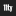

# Awesome Web Monetization [](https://awesome.re)

> Awesome stuffs about Web Monetization. Learn more, check modules and others tools.

## Contents

- [Awesome Web Monetization ](#awesome-web-monetization-img-srchttpsawesomerebadge-flat2svg-altawesome)
  - [Contents](#contents)
  - [About Web Monetization](#about-web-monetization)
  - [- Grant For The Web](#ulligrant-for-the-webliul)
  - [How to start monetize my website](#how-to-start-monetize-my-website)
  - [Resources](#resources)
    - [Packages](#packages)
      - [*Any packages/modules and plugins*](#any-packagesmodules-and-plugins)
    - [Tutorials](#tutorials)
    - [Articles](#articles)
    - [Newsletters](#newsletters)
    - [Videos](#videos)
    - [Books](#books)
    - [Blogs](#blogs)
    - [Courses](#courses)
    - [Tools](#tools)
    - [Community](#community)
    - [Miscellaneous](#miscellaneous)
  - [Contribute](#contribute)

## About Web Monetization

Web Monetization is a web service that allows you to send money directly in your browser. — If you want you know more, see :

- [Webmonetization.org](https://webmonetization.org/)
- [Documentation](https://webmonetization.org/docs/getting-started.html)
- [How Web Monetization work for paying payments](https://webmonetization.org/docs/sending)
- [How Web Monetization work for receiving payments](https://webmonetization.org/docs/receiving)
- [Specifications](https://webmonetization.org/specification.html)
- [ILP Forum](https://forum.interledger.org/)
- [Grant For The Web](https://www.grantfortheweb.org/)
---
- [Interledger : Open protocol suite for sending payments across different ledgers](https://interledger.org/)
- [Coil : Web monetized content in your browser while supporting sites you love in real time.](https://coil.com)

## How to start monetize my website

If you would like to monetize your content, you must have a Wallet and Provider account. See below the platforms that allow you to use them.

<details><summary>More details here</summary>
<p>

| **Wallets** |                                  |                                                         |                                              |                                                      |
|:-----------:|:--------------------------------:|:-------------------------------------------------------:|:--------------------------------------------:|:----------------------------------------------------:|
| Name        | [![Uphold][uphold-logo]][uphold] | [![GateHub][gatehub-logo]][gatehub]                     | [![Stronghold][stronghold-logo]][stronghold] | [New Wallet ?<br>Create a issue !][new-wallet-issue] |
| Fees        | None                             | SEPA: 1.00 EUR < 50,000 EUR<br>Wire: $15 min ($150 max) | $3 withdrawal fee                            |                                                      |

[new-wallet-issue]: https://github.com/thomasbnt/awesome-web-monetization/issues/new?assignees=thomasbnt&labels=Wallet%2C+%E2%86%94+WM+repository&template=new-wallet.md&title=%5BWa%5D

[gatehub]: https://gatehub.net
[gatehub-logo]: https://webmonetization.org/img/gatehub_logo.svg

[stronghold]: https://stronghold.co/real-time-payments#coil
[stronghold-logo]: https://webmonetization.org/img/stronghold_logo.svg

[uphold]: https://uphold.com
[uphold-logo]: https://webmonetization.org/img/uphold_logo.svg

If you are use already XRP Tipbot, [check here to migrate on Uphold](https://webmonetization.org/docs/xrptipbot).

| **Payments**  |                                                                            |
|---------------|----------------------------------------------------------------------------|
| Name          | [](https://coil.com) |
</p>
</details>

On your webpage, intregate your `monetization` tag on meta
```html
<meta name='monetization' content='$ilp.example.com/123456789'>
```
and detect if `monetization` is possible, then work

```js
if (document.monetization) {
    document.monetization.addEventListener('monetizationstart', () => {
        console.log("🎉 Awesome ! You use Web Monetization.\nMore information https://webmonetization.org")
    })
}
```
## Resources
### Packages

#### *Any packages/modules and plugins*

- [svelte-monetization](https://github.com/sorxrob/svelte-monetization) - A minimal and lightweight wrapper for the Web Monetization API 
- [monetize.js](https://github.com/sunchayn/monetize.js) - An event-driven library to manage and simulate Web Monetization 
- [types-wm](https://github.com/dacioromero/types-wm) - TypeScript definitions for Web Monetization 
- [ngx-monetization](https://github.com/CDDelta/ngx-monetization) - Web Monetization API for Angular ! 
- [react-hook-wm](https://github.com/dacioromero/react-hook-wm) - React hooks for integrating with Web Monetization 
- [react-monetize](https://github.com/guidovizoso/react-monetize) - Helpers and hooks to speed up your integration with Web Monetization API 
- [ep_monetization](https://github.com/ISNIT0/ep_monetization) - Plugin for applying payment pointer meta tag to Etherpad site 
- [wp-connect-coil](https://wordpress.org/plugins/wp-connect-coil/) - Plugin for applying Coil payment pointer meta tag to WordPress site 
- [xrptipbot-wordpress-widget](https://wordpress.org/plugins/widget-xrptipbot/) - Wordpress Widget based on XRPTIPBOT embed code to donate content creators 
- [eleventy-plugin-monetization](https://github.com/DanCanetti/eleventy-plugin-monetization) - An Eleventy plugin to monetize posts and site content 
- [web-monetization-components](https://github.com/philnash/web-monetization-components) - A collection of web components you can use on your web monetized websites 
- [revshare](https://github.com/kewbish/revshare) - A JS library for revenue sharing 
- [web-monetized-video](https://github.com/Jasmin2895/web-monetized-video) - experimenting with web monetisation API 
- [web-monetization-proxy](https://github.com/tcdowney/web-monetization-proxy) - Simple Go proxy for injecting Web Monetization meta tags 
- [gridsome-plugin-monetization](https://github.com/Sergix/gridsome-plugin-monetization) - Web monetization for Gridsome 
- [vuepress-plugin-web-monetization](https://github.com/spekulatius/vuepress-plugin-web-monetization) - Adds the web-monetization metatag to your VuePress website 
- [jekyll-web_monetization](https://github.com/philnash/jekyll-web_monetization) - A Jekyll plugin to add Web Monetization API payment pointers to your site 
- [monetization](https://github.com/KNawm/monetization) - A wrapper around the Web Monetization API to monetize apps  

### Tutorials

- [Official "Getting started" from webmonetization.org](https://webmonetization.org/docs/getting-started)
- [Put exclusive content on your website](https://webmonetization.org/docs/exclusive-content)

### Articles

- [Monetizing Content in View, Paying for what you see](https://dev.to/godwinagedah/monetizing-content-in-view-paying-for-what-you-see-462a)
- [Web Components for the Web Monetization API (serie)](https://dev.to/philnash/web-components-for-the-web-monetization-api-4ed9)

### Newsletters

- [Newsletter of grantfortheweb.org](https://www.grantfortheweb.org/signup)

### Videos
### Books
### Blogs
### Courses
### Tools

- [Is web monetized](https://github.com/jkga/is-web-monetized) - A very simple tool for checking if Web Monetization is enabled

- [Paytrackr](https://github.com/sorxrob/paytrackr) - Track and manage your micropayments into one place

  > PayTrackr is the easiest and safest way to track and manage your micropayments to web monetized websites, having a web monetization provider membership.

- [Akita](https://github.com/dog-s/akita) - A browser extension that gives you insight into your involvement with Web Monetization

  > Akita presents your top visited monetized sites, how much time you're spending on them, and how much you're contributing (or could contribute) to them.

- [Open Monetization Wallet](https://github.com/signalnerve/openmonetizationwallet) - Tools for managing your vanity Web Monetization wallet

  > Open Monetization Wallet (OMW) makes it easier to accept payments with the Web Monetization API at scale. Some features:
  >
  > - Custom wallet URLs: own your own "Payment Pointer", e.g. $wallet.signalnerve.com, instead of $pay.stronghold.co/abcdef123
  > - Change between wallets/providers with no downtime
  > - Logs of incoming payment requests
  > - Revenue sharing between multiple wallets, e.g. for multiple team members
  > - Infinitely scalable with serverless technology
  > - Free and open-source

### Community

- [grantfortheweb.org forum](https://forum.grantfortheweb.org/)
- [@GrantForTheWeb on Twitter](https://twitter.com/GrantForTheWeb)
- [@Coil on Twitter](https://twitter.com/Coil)
- [@CinnamonVideo on Twitter](https://twitter.com/CinnamonVideo)
- [Web Monetization tag on DEV](https://dev.to/t/webmonetization)

### Miscellaneous

---

## Contribute

Contributions welcome ! Read the [contribution guidelines](contributing.md) first.
You can also contribute to share this repository and Web Monetization with your friends. 😄

If you want add a new small icon, the height must be **16px**. Put in `assets/small_icons/NAME.png`. Format PNG only accepted.

